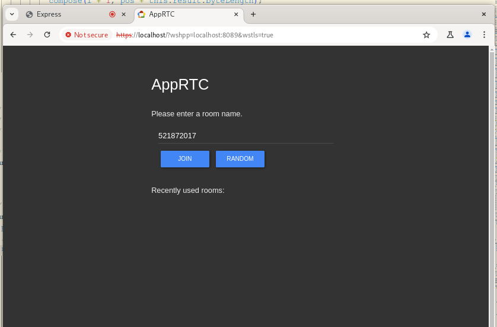
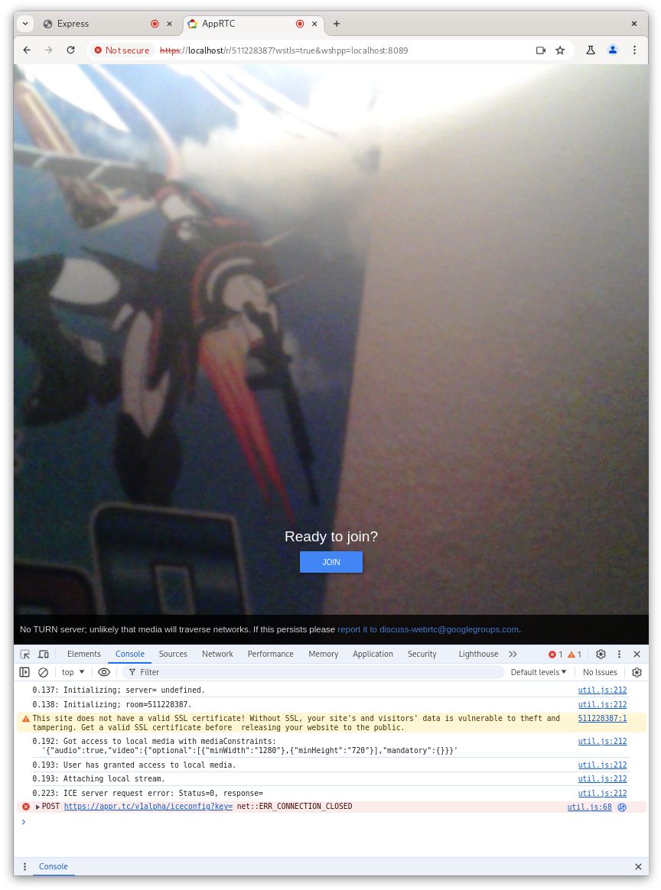
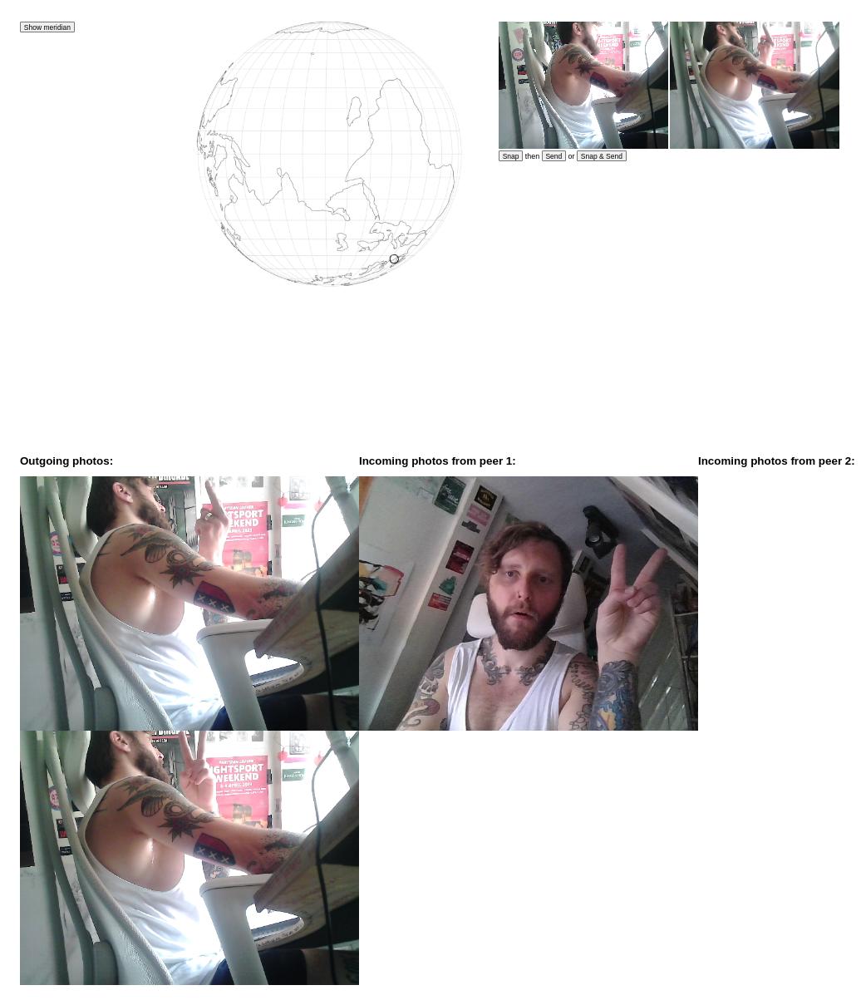
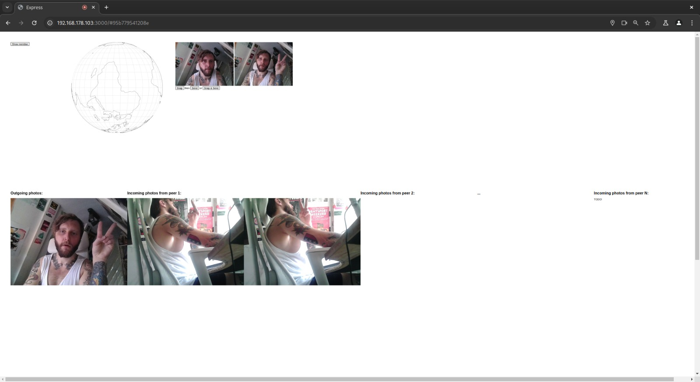

## WIP

Run `DEBUG=frontend:* pnpm start` and navigate to the IP of the host

### TODO

These lists are themselves WIP (ie: to be updated!) and serve as the roadmap and ADR (Architecture Decision Record)

#### Primary

```
[x] Send geo-tagged photo peer-to-peer with WebRTC
[ ] Video (with location and, naturally, audio) streaming
[ ] Make responsive UI/UX
[ ] Peers can download video (and join mid-stream) 
[ ] Deployment - CI(/CD)?
```

#### Secondary

```
[ ] Handle use case w/o user media (camera): recieve-only
[ ] Make `.../#xyz` URL suffix into an input
[ ] Use a contrasting colour for the map points
```

#### Tertiary

```
[ ] User login, config
[ ] Basic map navigation
[ ] Explore available rooms (streams)
```

### End state

See the appRTC demo application https://github.com/webrtc/apprtc/ and samples https://webrtc.github.io/samples/





### Current state

**FIXME: Update screenshots!**

#### Peer 1 (also the server)



#### Peer 2

